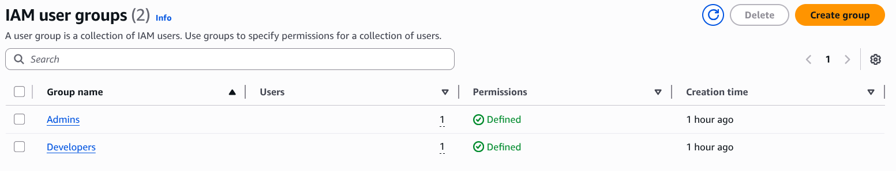
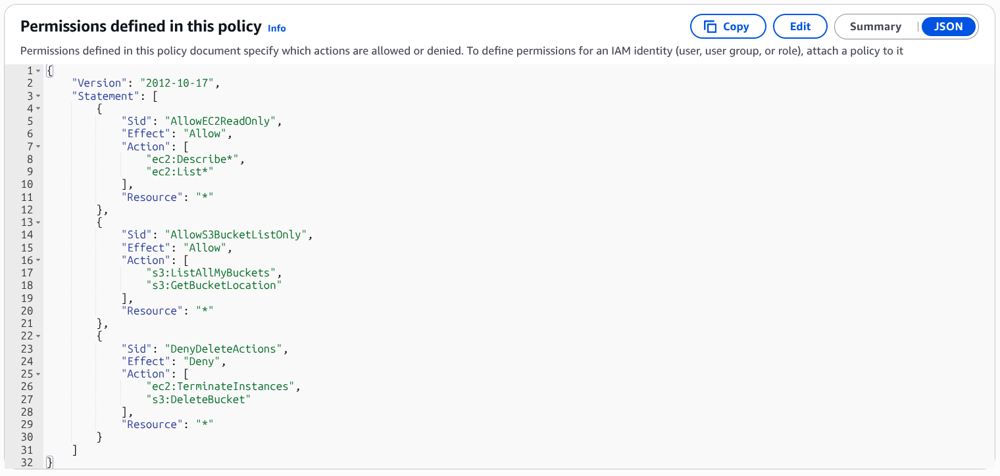
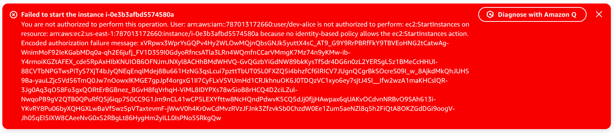
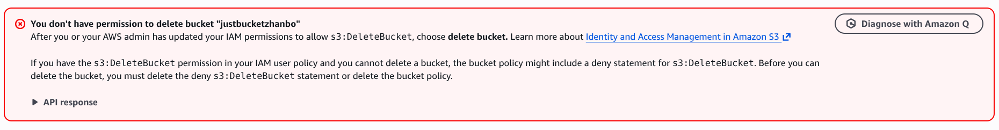
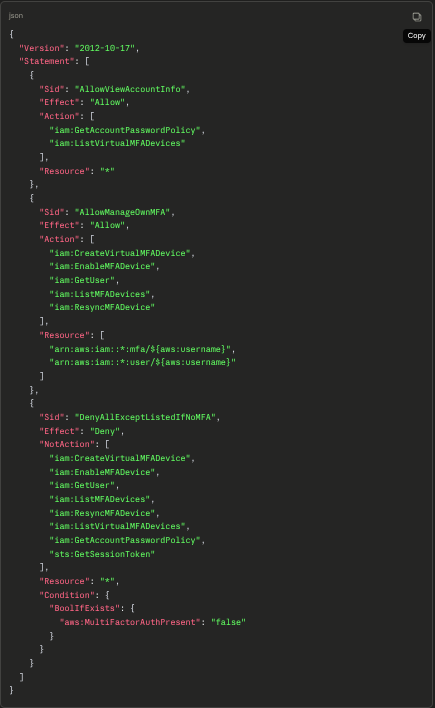
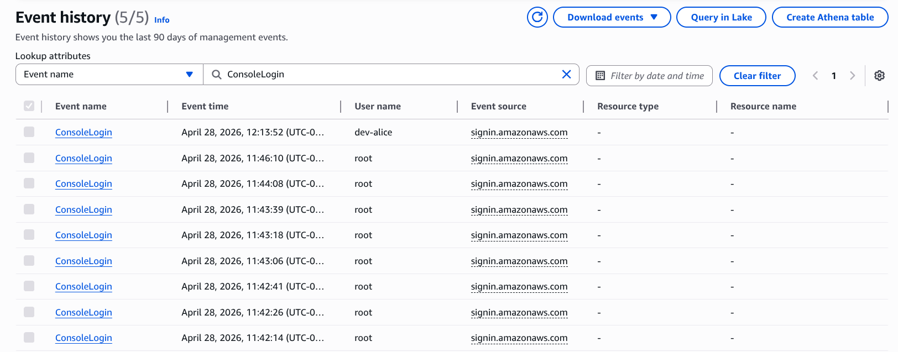

# ☁️ AWS Cloud Labs Portfolio

Hands-on AWS labs built to learn and troubleshoot real cloud scenarios.
Each lab includes what I built, what went wrong, and how I fixed it.

**Goal:** Cloud Support Associate / Cloud Support Engineer roles

---

## Lab Progress

| # | Lab | Status |
|---|-----|--------|
| 01 | IAM Users, Groups & Custom Policies | ✅ Done |
| 02 | MFA Enforcement + CloudTrail | ✅ Done |
| 03 | IAM Roles for EC2 | 🔜 Coming |

---

## Lab 01 — IAM Users, Groups & Custom Policies

**What I built:** A production-style IAM structure with two groups (Developers, Admins), two users, and a custom least-privilege policy that explicitly denies destructive actions like terminating EC2 instances or deleting S3 buckets.

**Key lesson:** Explicit Deny always overrides Allow in IAM — no matter what other policies say.

**What went wrong:** After logging in as dev-alice, the EC2 instance created by root was invisible. Turned out to be a region mismatch — root created the instance in us-east-1 but alice's console was showing us-west-2. Switching the region dropdown fixed it instantly. This is one of the most common real support tickets.

---

## Lab 02 — MFA Enforcement + CloudTrail

**What I built:** Enabled MFA on IAM users and created a policy that blocks all AWS actions unless the session was authenticated with MFA. Then set up a CloudTrail trail to log every API call to S3, and verified it by finding my own login event in Event History — including confirmation that MFA was used.

**Key lesson:** CloudTrail is the answer to "who did this and when" — every action in AWS is logged including logins, resource changes, and deletions. Event records contain sensitive info (account ID, IP address) so screenshots should be redacted before posting publicly.

---

## About Me
Actively building hands-on AWS skills to prepare for a Cloud Support Engineer role.

- LinkedIn: https://www.linkedin.com/in/zhanbolot-erali-317a28173/
- Email: ezhanbolot@gmail.com
